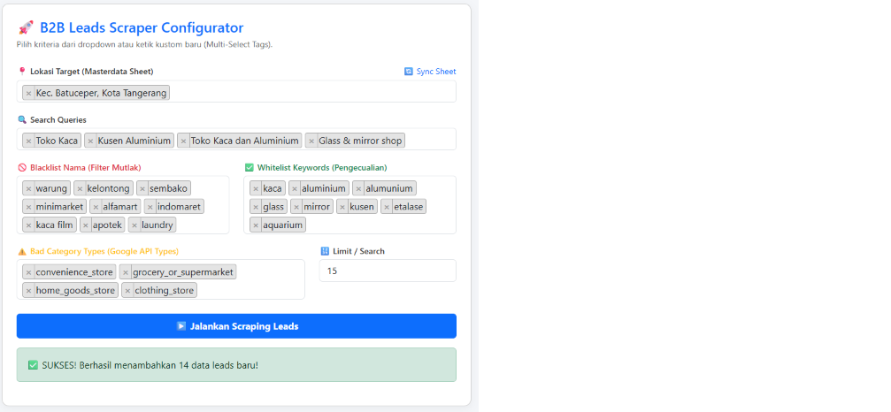
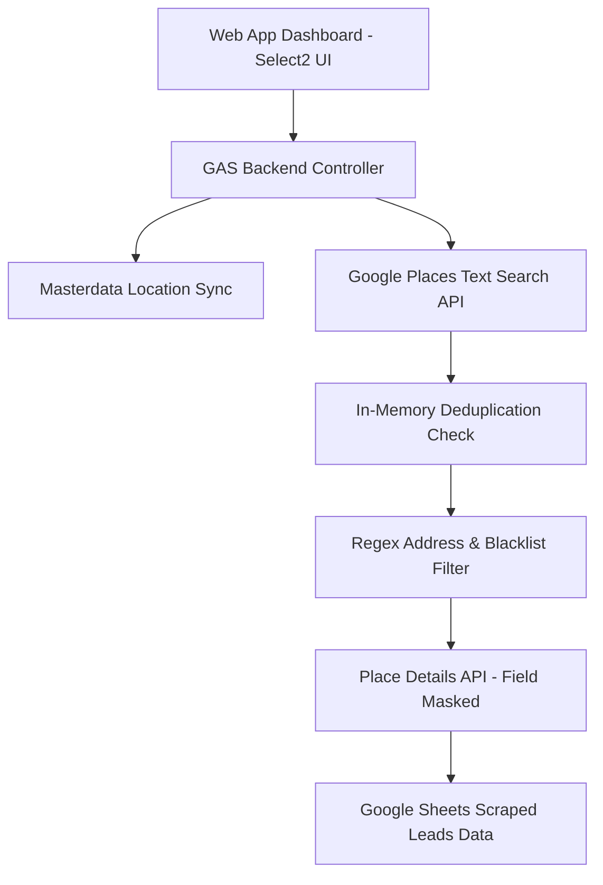

# 🚀 B2B Lead Generation Pipeline & Web App (Google Places API & Apps Script)



## 📌 Overview
An enterprise-grade B2B lead generation tool built on **Google Apps Script** and **Google Places API**. It features an interactive **Web App UI** (powered by Bootstrap 5, jQuery, and Select2), allowing users to dynamically configure search queries, select target locations directly synced from Google Sheets Masterdata, and enforce strict filtering criteria without modifying source code.

### 🎯 Key Features & Impact
* **Interactive Web App Interface:** Configurable dashboard with multi-select dropdown tags and instant synchronization with Google Sheets Masterdata.
* **Cost & Quota Optimization:** Implements `FieldMask` filtering on Place Details API calls, reducing Google Cloud API billing costs by up to 60%.
* **Strict Multi-Layer Filtering:**
  * **Anti-Duplicate Memory:** In-memory `Set()` lookup on existing `place_id`s prevents redundant API calls and duplicate sheet entries.
  * **Smart Address Normalization:** Regex engine matching Indonesian address abbreviations (e.g., *Bar. → Barat*, *Pd. → Pondok*, *Kp. → Kampung*).
  * **Dynamic Blacklist & Whitelist:** Multi-step category and keyword filter to immediately discard irrelevant businesses (e.g., *warung*, *kaca film*, *convenience stores*).
* **Data Ethics & PII Compliance:** Includes automated masking formulas for public sample datasets to protect personal identifiable information (PII).

---

## 🛠️ Tech Stack
* **Language:** Google Apps Script (JavaScript ES6+)
* **Frontend UI:** HTML5, CSS3, Bootstrap 5, jQuery, Select2 (Multi-Select Tags)
* **API Integration:** Google Places API (Text Search & Place Details with Field Masking)
* **Storage & Orchestration:** Google Sheets API, `PropertiesService` (State Persistence)

---

## 🏗️ Architecture & Data Flow



## 📖 Sample Dataset & PII Masking Schema

For portfolio demonstration and privacy compliance, phone numbers, exact street addresses, and Place IDs in public sample files are masked using spreadsheet transformations:

| Column Name | Raw Scraped Format | Masked Portfolio Format | Applied Logic / Formula |
| :--- | :--- | :--- | :--- |
| **`Place ID`** | `ChIJN1t_tS2L...` | `PID-270F-3A9B12` | Pseudo-hash obfuscation |
| **`Name`** | `Toko Kaca Berkah Abadi` | `Store 001 - Toko Kaca` | Standardized anonymized identifier |
| **`Address`** | `Jl. Raya Industri No. 45, Cikarang Sel.` | `Jl. [REDACTED], Cikarang Sel.` | `=REGEXREPLACE(C2, "^[^,]+,", "Jl. [REDACTED],")` |
| **`Phone Number`** | `081234567890` | `0812 **** 90` | `=LEFT(D2, 4) & " **** " & RIGHT(D2, 2)` |
| **`Latitude / Longitude`** | `-6.289123, 107.123456` | `-6.29, 107.12` | `=ROUND(J2, 2)` (Fuzzy Location) |
| **`Rating / Reviews`** | `4.8 / 120` | `4.8 / 120` | Preserved for business analytics |


## ⚙️ Deployment & Setup Instructions

### 1. Google Cloud Platform Setup
1. Enable **Places API** in your Google Cloud Console.
2. Generate an **API Key** and restrict it to your Apps Script domain if necessary.

### 2. Google Apps Script Configuration
1. Open your target Google Sheet.
2. Navigate to **Extensions** → **Apps Script**.
3. Go to **Project Settings** (⚙️) → **Script Properties** and add:
   * **Property:** `GOOGLE_PLACES_API_KEY`
   * **Value:** *Your GCP API Key*
4. Copy the project files from `src/` (`Code.gs`, `AppScriptServices.gs`, `Index.html`).

### 3. Deploy Web App
1. In Apps Script Editor, click **Deploy** → **New Deployment**.
2. Select **Web App** as the deployment type.
3. Configure deployment settings:
   * **Execute as:** `Me (your email)`
   * **Who has access:** `Anyone` (or `Only myself`)
4. Click **Deploy** and open the generated Web App URL.

## 📁 Repository Structure
```text
├── src/
│   ├── Code.gs                   	   # Web App controller & Places API orchestrator
│   └── Index.html                	   # Bootstrap 5 & Select2 Multi-Select Web Dashboard
│   └── .clasp.json                   	# Google Apps Script CLI config
│   └── appsscript.json               	# Manifest file
├── data/
│   ├── sample_masterdata.csv     	   # Sample target locations (Districts/Kecamatan)
│   └── sample_scraped_leads.csv  	   # Anonymized sample output dataset
│   └── sampel_schema.csv		         # sample schema
├── assets/
│   ├── webapp-dashboard-preview.png	# Web App interface screenshot
│   └── architecture-diagram.png     	# Data pipeline flowchart
└── README.md                     	   # Repository documentation
```