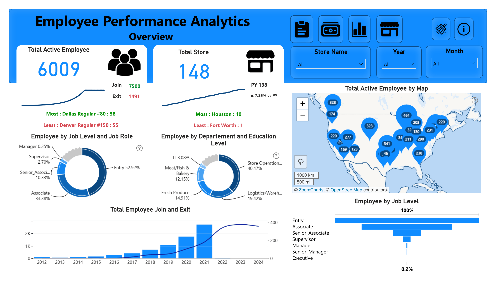
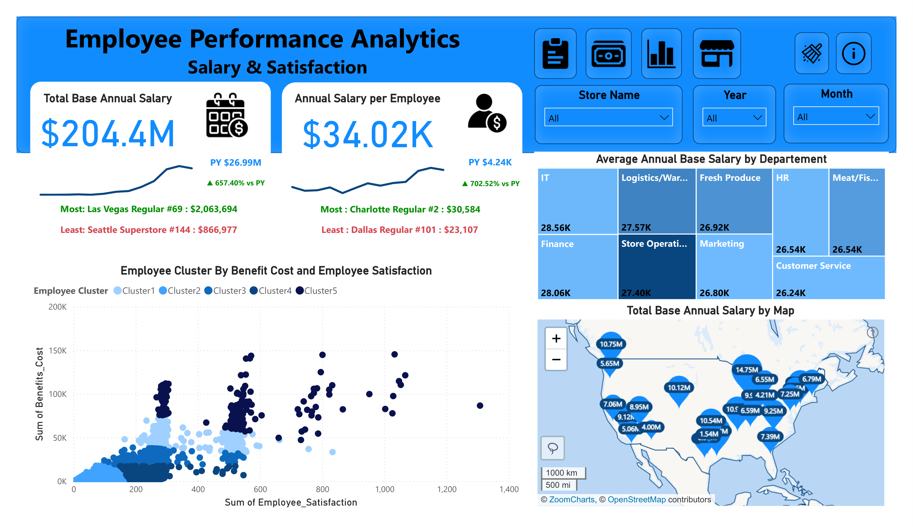
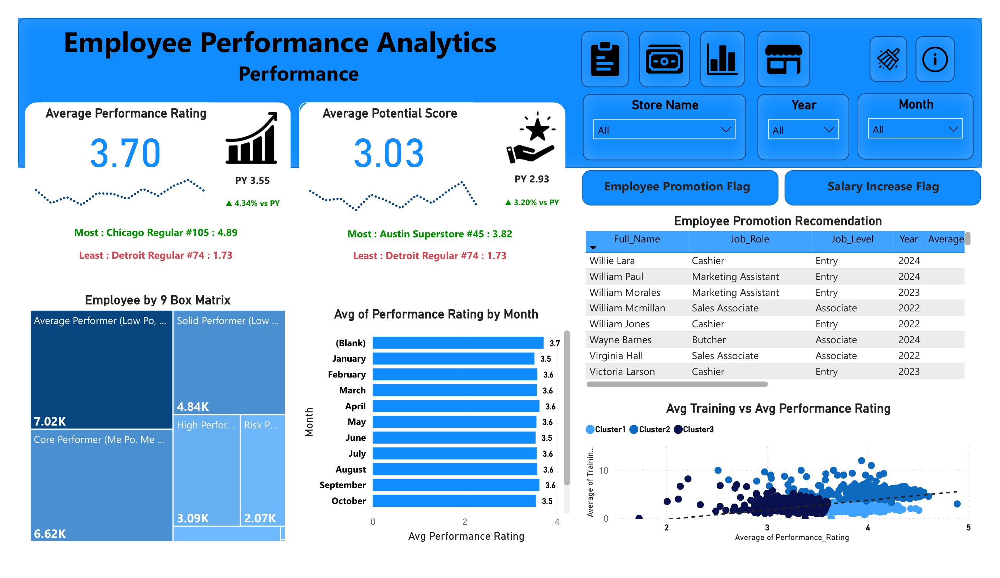
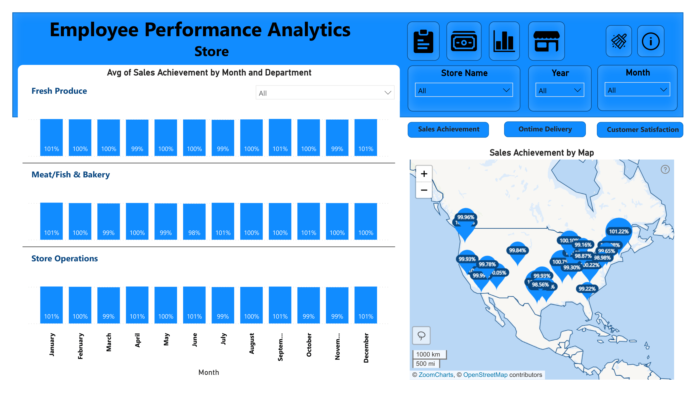

# 📊 Employee Performance Analytics

## 📌 Business Overview
I created this dashboard as a project for a challenge hosted by Zoom Charts, a leading provider of data visualization tools. It's designed to give a comprehensive overview of employee performance, combining key HR metrics into one intuitive and interactive platform 

### 🎯 Key Impact
* Solve tickets faster
* Spot common or recurring issues
* Understand which requests take the most time or effort
* Improve workflows and customer satisfaction

| Page | Section Name | Primary Business Focus | Key Metrics & Highlights |
| :--- | :--- | :--- | :--- |
| **Page 1** | **Executive Overview** | Headcount dynamics, store expansion, & attrition | Active Employees (6,009), Total Stores (148) |
| **Page 2** | **Salary & Satisfaction** | Compensation analysis & employee benefit clustering | Total Base Salary ($204.4M), Avg Salary ($34.02K) |
| **Page 3** | **Performance & Talent** | Appraisal evaluation, training impact, & 9-Box Grid | Avg Performance (3.70), Avg Potential (3.03) |
| **Page 4** | **Store Operations** | Operational SLA, sales achievement, & customer satisfaction | Dynamic Bookmarks (Sales, Delivery, CSAT) |

---

## 🧩 Page-by-Page Documentation

### 🧩 Page 1: Executive Overview

> **Page Purpose:** Provides a high-level summary of headcount dynamics, store expansion, and historical employee attrition.

**📌 Key Visual Breakdown:**
* **Headcount & Geographic Distribution:**
  * **Total Active Employees:** **6,009** (Joined: 7,500 | Exited: 1,491).
  * **Location Map:** Map visual mapping active employee density across US store locations.
* **Store Footprint:**
  * **Total Stores:** **148** (+7.25% YoY growth compared to Previous Year).
* **Workforce Demographics:**
  * **By Job Level & Role:** Donut & Funnel charts showing structural breakdown from Entry-level (3K) down to Executive (5).
  * **Department Breakdown:** Store Operations holds the highest headcount (2K), followed by Logistics/Warehousing (1K) and Fresh Produce (896).
* **Attrition Trend:** Historical bar chart tracking annual employee joins and exits from 2012 to 2024.

---

### 🧩 Page 2: Salary & Satisfaction Analysis

> **Page Purpose:** Analyzes compensation allocation, departmental pay scales, and employee satisfaction relative to benefit costs.

**📌 Key Visual Breakdown:**
* **Compensation Metrics:**
  * **Total Base Annual Salary:** **$204.4M**.
  * **Average Salary per Employee:** **$34.02K**.
* **Departmental & Regional Analysis:**
  * **Top Paying Department:** IT Department leads with the highest average salary at **$28.56K**.
  * **Geographic Salary Mass:** Map visual displaying base salary volume ($M) across regions.
* **Advanced Analytics & Clustering:**
  * **Benefit vs. Satisfaction Scatter Plot:** Groups workforce into 5 distinct clusters (Cluster 1–5) based on benefit expenditure and satisfaction scores.

---

### 🧩 Page 3: Performance & Talent Evaluation

> **Page Purpose:** Tracks appraisal ratings, promotion/salary growth rates, and talent categorization using the 9-Box Matrix.

**📌 Key Visual Breakdown:**
* **Appraisal Benchmarks:**
  * **Average Performance Rating:** **3.70 / 5.00**.
  * **Average Potential Score:** **3.03 / 5.00**.
* **Talent Management Framework:**
  * **9-Box Grid:** Classifies employees based on performance vs. potential (e.g., *High Performer, Core Performer, Solid Performer*).
  * **Training Impact:** Scatter plot analyzing training hours against performance ratings across employee groups.
* **Monthly Trends & Growth Flags:**
  * Monthly performance rating breakdown (identifying lower seasonal rating averages in Jan, Jun, and Oct at 3.5).
  * Key KPI cards displaying **Employee Promotion Flag %** and **Salary Increase Flag %** compared to PY.

---

### 🧩 Page 4: Store Operational Metrics

> **Page Purpose:** Dynamic operational performance tracker focusing on store-level sales targets, delivery SLAs, and customer satisfaction.

**📌 Key Visual Breakdown:**
* **Interactive Bookmark Navigation:**
  * Seamlessly toggles visual focus between **Sales Achievement %**, **On-Time Delivery (OTD) %**, and **Customer Satisfaction Score**.
* **Store & Departmental Breakdown:**
  * **Regional SLA Map:** Location map indicating metric fulfillment rates per store branch.
  * **Department Monthly Performance:** Bar chart comparing monthly achievement rates across Fresh Produce, Meat/Fish & Bakery, and Store Operations.

---

## 🛠️ Data Architecture & Tools
* **BI Platform:** Power BI Desktop / Power BI Service
* **Data Modeling:** Star Schema (Fact & Dimension Tables)
* **Calculations:** DAX Measures (Time Intelligence, YoY, Custom Formatting)
* **Design Standards:** Dark Minimalist Theme with High-Contrast KPI Cards

## 🔗 Live Interactive Dashboard
https://app.powerbi.com/view?r=eyJrIjoiNTE3MGNjYzctNmIzYS00YTYyLTk5MjItZmMxNWVhOGRhMDAwIiwidCI6IjQ2NTRiNmYxLTBlNDctNDU3OS1hOGExLTAyZmU5ZDk0M2M3YiIsImMiOjl9