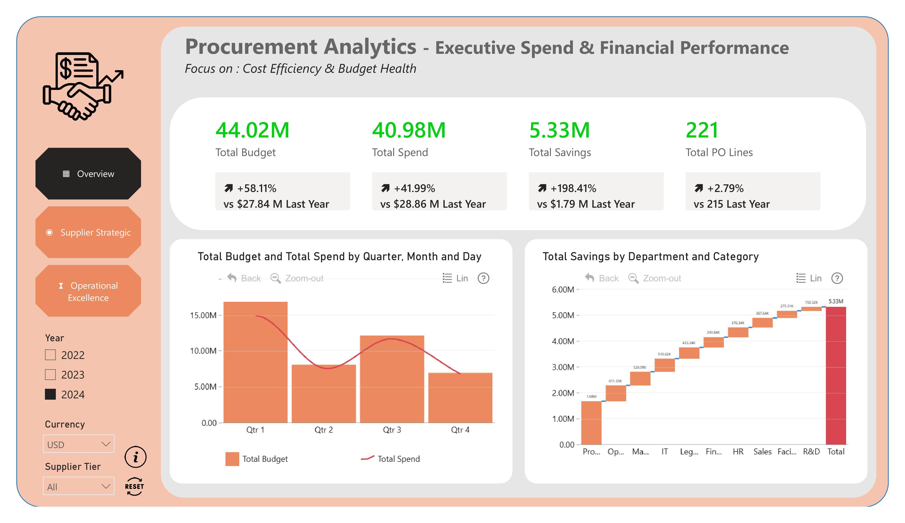
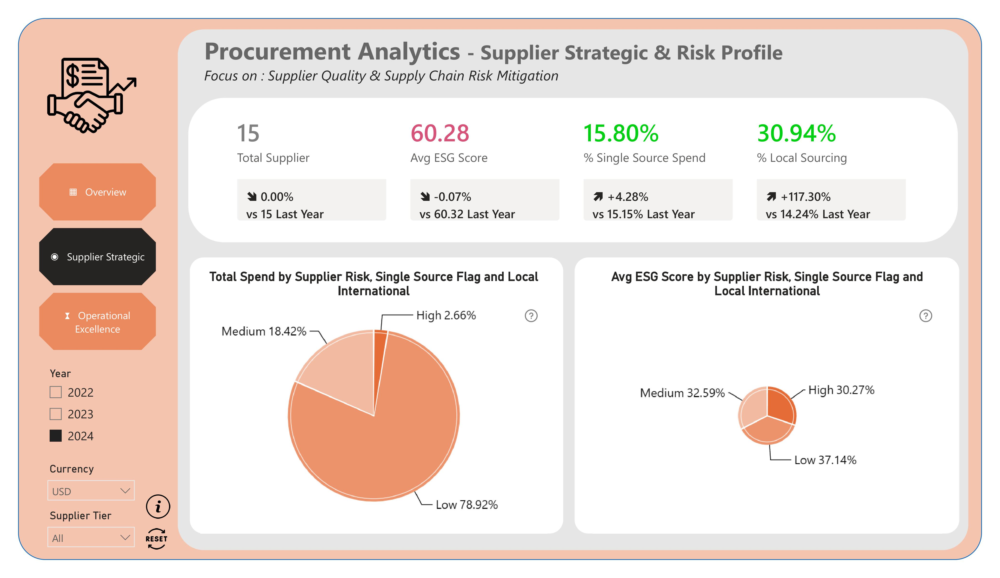
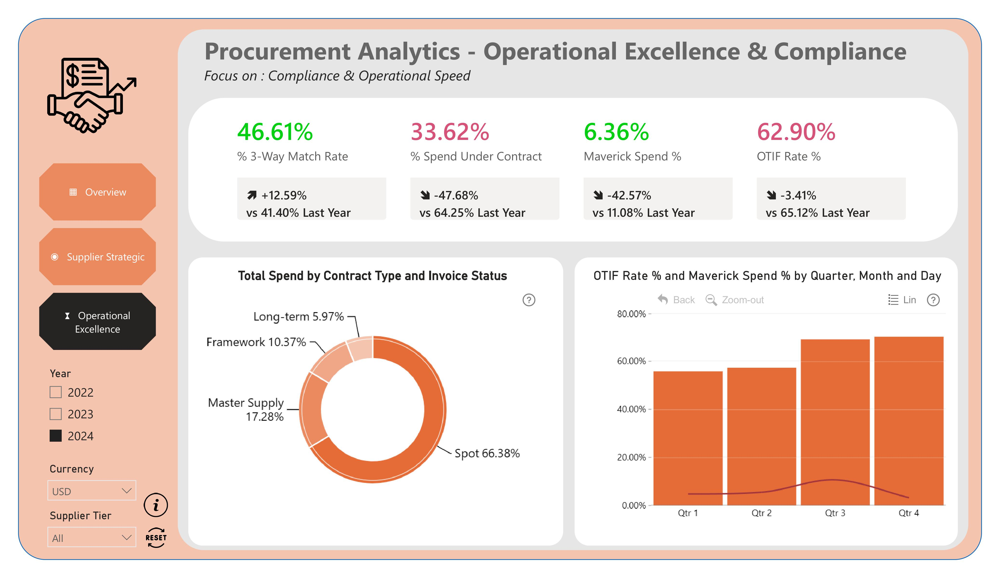

# 📊 Procurement Analytics

## 📌 Business Overview
I created this dashboard for the FP20 Analytics Challenge 37 in collaboration with ZoomCharts. The project is designed to give procurement leaders a single, interactive view of spend, supplier performance, delivery reliability, and compliance risks across the purchasing lifecycle.

### 🎯 Key Impact
* Track actual spend against budget and identify cost leakage
* Understand which suppliers drive the most value and risk
* Highlight maverick spend and non-compliant purchasing behavior
* Improve delivery performance and reduce invoice issues
* Support smarter sourcing and contract decisions

| Page | Section Name | Primary Business Focus | Key Metrics & Highlights |
| :--- | :--- | :--- | :--- |
| **Page 1** | **Executive Overview** | Budget, spend trend, and savings performance | Total Spend **$979.4M**, Total Budget **$1.01B**, Total Savings **$104.3M** |
| **Page 2** | **Supplier Performance & Savings** | Supplier concentration, preferred suppliers, and sourcing risk | **15 suppliers**, **$105.4M** Maverick Spend, **33.4%** spend on preferred suppliers |
| **Page 3** | **Delivery & Compliance** | OTIF, lead time, invoice exceptions, and operational risk | OTIF **64.1%**, Avg Lead Time **36.4 days**, Overdue + Disputed Invoices **$263.8M** |

---

## 🧩 Page-by-Page Documentation

### 🧩 Page 1: Executive Overview

> **Page Purpose:** Provides a high-level summary of total procurement spend, budget performance, and savings opportunities across the whole operating period.

**📌 Key Visual Breakdown:**
* **Spend & Budget Health:**
  * **Total Procurement Spend:** **$979.4M** across **5,200 PO lines** from 2022–2024.
  * **Approved Budget:** **$1.01B**, showing a strong opportunity to tighten cost control and spend discipline.
* **Savings Lens:**
  * **Total Savings:** **$104.3M**, equivalent to **10.3%** of total budget.
  * Savings trends are tracked over time to highlight where procurement teams are capturing value.
* **Spending Distribution:**
  * Category and department views reveal where the largest purchasing concentrations occur.
  * Helps leaders quickly identify the biggest spend pools and possible optimization targets.

---

### 🧩 Page 2: Supplier Performance & Savings

> **Page Purpose:** Evaluates supplier contribution, maverick buying, risk exposure, and sourcing compliance across preferred and single-source suppliers.

**📌 Key Visual Breakdown:**
* **Supplier Contribution Analysis:**
  * Top suppliers such as **Delta Engineering**, **Blue Horizon Packaging**, and **Cornerstone Services** drive the largest share of spend.
  * Spend concentration helps procurement teams identify supplier dependency and negotiation leverage.
* **Preferred vs. Non-Preferred Suppliers:**
  * **$326.9M** of spend is associated with preferred suppliers, while **$105.4M** is categorized as maverick spend.
  * This highlights procurement leakage and opportunities for better compliance with approved suppliers.
* **Risk & Sourcing Structure:**
  * Supplier segmentation by **risk level**, **tier**, **country/region**, and **ESG score** supports strategic vendor management.
  * Single-source spend is also monitored to flag dependency risk and resilience concerns.

---

### 🧩 Page 3: Delivery & Compliance

> **Page Purpose:** Tracks service reliability, lead-time performance, and invoice-control issues to identify risk and delay hotspots in the procurement process.

**📌 Key Visual Breakdown:**
* **Delivery Reliability:**
  * **On-Time Delivery (OTD):** **64.1%** across all PO lines.
  * **Average Lead Time:** **36.4 days**, with delays largely concentrated in specific suppliers, categories, and departments.
* **Operational Risk Signals:**
  * Delay and lead-time analysis identifies where supplier performance is slipping and which categories are most exposed.
  * Risk drivers are evaluated alongside contract type and supplier tier to support intervention planning.
* **Invoice & Payment Control:**
  * **Overdue + Disputed Invoice Spend:** **$263.8M**.
  * This page surfaces mismatches, payment friction, and control gaps that can affect cash flow and supplier relationships.

---

## 🛠️ Data Architecture & Tools
* **BI Platform:** Power BI Desktop / Power BI Service
* **Data Modeling:** Star Schema and Date Table integration using the provided calendar table
* **Core Measures:** Total Spend, Total Budget, Total Savings, Savings %, Maverick Spend, OTIF Rate %, Avg Lead Time, Avg Days Late
* **Analytics Stack:** DAX calculations, time intelligence, KPI cards, cross-filtering, and drill-down visuals
* **Design Standards:** Dark-themed executive layout with clean KPI cards, drill paths, and high-contrast comparison views

## 📁 Project Files
* [models/Procurement Analytics.pbix](models/Procurement%20Analytics.pbix)
* [data/FP20_Procurement_C37 Dataset.xlsx](data/FP20_Procurement_C37%20Dataset.xlsx)
* [docs/Intro & Brief_Challenge 37_English.docx](docs/Intro%20%26%20Brief_Challenge%2037_English.docx)
* [models/scripts/measure.csv](models/scripts/measure.csv)

## 🔎 Challenge Context
This analysis was built around the FP20 Analytics procurement challenge, where the goal is to understand how procurement teams can balance cost efficiency, supplier management, on-time delivery, and compliance across a multi-year operating dataset. The resulting dashboard is intended to help business users quickly answer the key operational questions behind procurement performance.

