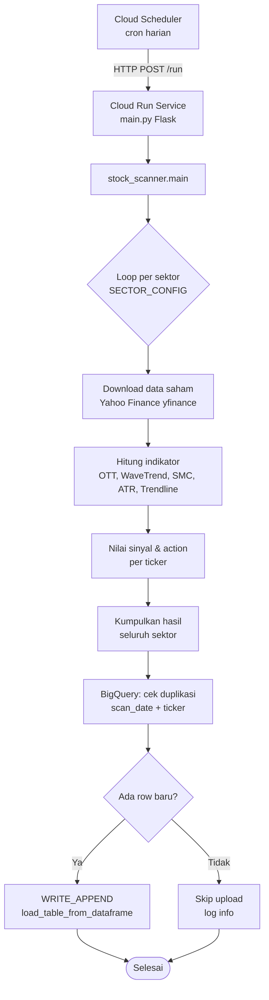

# Stock Scanner for BigQuery

Pipeline harian untuk memindai saham di IDX dan menulis hasil analisis ke BigQuery dengan mode append yang aman. Project ini dirancang untuk dijalankan secara lokal maupun di Cloud Run, dengan trigger dari Cloud Scheduler.

## Struktur project

- `main.py` — entrypoint Flask untuk Cloud Run / web service
- `src/stock_scanner.py` — logika utama scanner, indikator, dan upload ke BigQuery
- `src/sectors.py` — daftar sektor dan ticker saham
- `src/__init__.py` — package marker
- `dockerfile` — image Docker untuk deployment
- `requirements.txt` — dependency Python
- `.dockerignore` — file yang dikecualikan saat build image

## Alur kerja



## Environment variable

Tambahkan variabel berikut sebelum menjalankan atau saat deploy Cloud Run:

- `GCP_PROJECT_ID` — project ID Google Cloud
- `BQ_DATASET_ID` — dataset BigQuery
- `BQ_TABLE_NAME` — nama tabel, default `fact_ott_scanner_daily`
- `GCP_SA_KEY` — optional, JSON service account untuk autentikasi local / non-ADC

## Jalankan lokal

### 1. Siapkan virtual environment

Disarankan memakai virtual environment agar dependency terisolasi.

**Windows (PowerShell):**

```powershell
py -3 -m venv .venv
.\.venv\Scripts\Activate.ps1
```

**Linux / macOS:**

```bash
python3 -m venv .venv
source .venv/bin/activate
```

### 2. Install dependency

```bash
pip install -r requirements.txt
```

### 3. Set environment variable

Project butuh akses ke BigQuery. Ada dua opsi autentikasi:

**Opsi A — Application Default Credentials (ADC), paling mudah untuk lokal:**

```bash
gcloud auth application-default login
```

Lalu set project & dataset:

**Windows (PowerShell):**

```powershell
$env:GCP_PROJECT_ID = "project-1-474502"
$env:BQ_DATASET_ID  = "saham_analytics"
$env:BQ_TABLE_NAME  = "fact_ott_scanner_daily"
```

**Linux / macOS:**

```bash
export GCP_PROJECT_ID="project-1-474502"
export BQ_DATASET_ID="saham_analytics"
export BQ_TABLE_NAME="fact_ott_scanner_daily"
```

**Opsi B — Service Account JSON (tanpa `gcloud` login):**

Set `GCP_SA_KEY` berisi isi file JSON service account (satu baris, tanpa newline):

**Windows (PowerShell):**

```powershell
$env:GCP_SA_KEY = (Get-Content -Raw "path/to/sa-key.json")
$env:GCP_PROJECT_ID = "project-1-474502"
$env:BQ_DATASET_ID  = "saham_analytics"
$env:BQ_TABLE_NAME  = "fact_ott_scanner_daily"
```

**Linux / macOS:**

```bash
export GCP_SA_KEY="$(cat path/to/sa-key.json)"
export GCP_PROJECT_ID="project-1-474502"
export BQ_DATASET_ID="saham_analytics"
export BQ_TABLE_NAME="fact_ott_scanner_daily"
```

### 4. Jalankan

**Mode web service (Flask) — direkomendasikan, sama seperti di Cloud Run:**

```bash
python main.py
```

Service akan listen di `http://0.0.0.0:8080`. Cek health:

```bash
curl http://localhost:8080/
```

Trigger scan + upload ke BigQuery:

```bash
curl -X POST http://localhost:8080/run
```

**Mode script sekali jalan (tanpa web server):**

```bash
python -m src.stock_scanner
```

### 5. Catatan untuk lokal

- Scan seluruh sektor (~800+ ticker) butuh waktu cukup lama karena memanggil Yahoo Finance satu per satu.
- Jika hanya ingin test alur tanpa upload, set project/dataset ke nilai dummy — fungsi upload akan menangani error dengan log.
- Pastikan akun yang dipakai (ADC atau SA) punya role BigQuery Data Editor & BigQuery Job User pada project target.

## Docker

```bash
docker build -t stock-scanner .
docker run --rm -p 8080:8080 -e PORT=8080 stock-scanner
```

## Deploy ke Cloud Run

1. Build dan push image ke Artifact Registry.

```bash
gcloud builds submit --tag REGION-docker.pkg.dev/PROJECT_ID/REPO/stock-scanner:latest
```

2. Deploy container ke Cloud Run.

```bash
gcloud run deploy stock-scanner \
  --image REGION-docker.pkg.dev/PROJECT_ID/REPO/stock-scanner:latest \
  --region asia-southeast2 \
  --platform managed \
  --allow-unauthenticated \
  --memory 1Gi \
  --timeout 900 \
  --set-env-vars GCP_PROJECT_ID=PROJECT_ID,BQ_DATASET_ID=saham_analytics,BQ_TABLE_NAME=fact_ott_scanner_daily
```

3. Pastikan service account Cloud Run punya IAM:
   - BigQuery Data Editor
   - BigQuery Job User

4. Untuk trigger harian, gunakan Cloud Scheduler dengan target Cloud Run service `/run`.

Contoh membuat Cloud Scheduler:

```bash
gcloud scheduler jobs create http stock-scanner-daily \
  --schedule "0 17 * * 1-5" \
  --time-zone Asia/Jakarta \
  --uri "https://stock-scanner-XXXX.run.app/run" \
  --http-method POST
```

Contoh URL endpoint:

- `https://<service-url>/run`

## Catatan penting

- Append ke BigQuery dibuat aman dari duplikasi per `scan_date + ticker`.
- Script menggunakan `WRITE_APPEND` dan validasi sebelum load.
- Untuk deployment yang lebih aman, sebaiknya gunakan Cloud Run Job atau Cloud Run Service dengan endpoint HTTP.

## Struktur data target BigQuery

Kolom utama:

- `scan_date`
- `created_at`
- `sector`
- `ticker`
- `action`
- `score`
- `trend_ott`
- `price_today`
- `price_zone`
- `smc_status`
- `var_mavg`
- `ott_line`

## Troubleshooting

- Jika Docker build gagal, cek nama file dependency (`requirements.txt`).
- Jika Cloud Run gagal upload, cek permission IAM BigQuery dan service account.
- Jika data double, cek duplikasi per tanggal dan ticker dari query berikut:

```sql
SELECT scan_date, ticker, COUNT(*) AS total_rows
FROM `project_id.dataset_name.fact_ott_scanner_daily`
GROUP BY scan_date, ticker
HAVING COUNT(*) > 1
```
