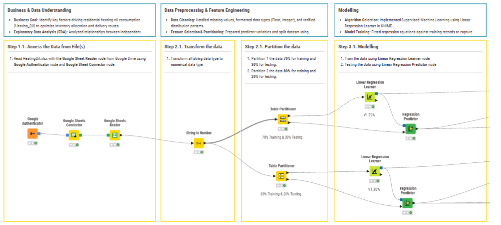
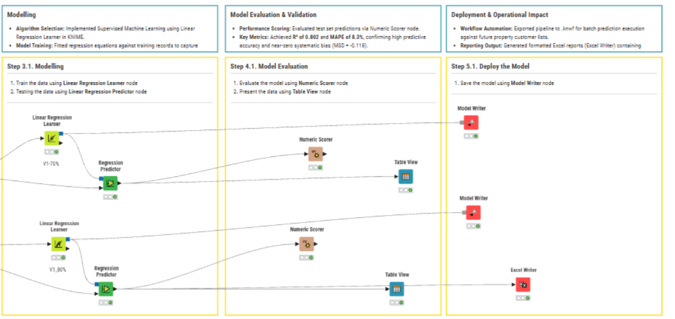
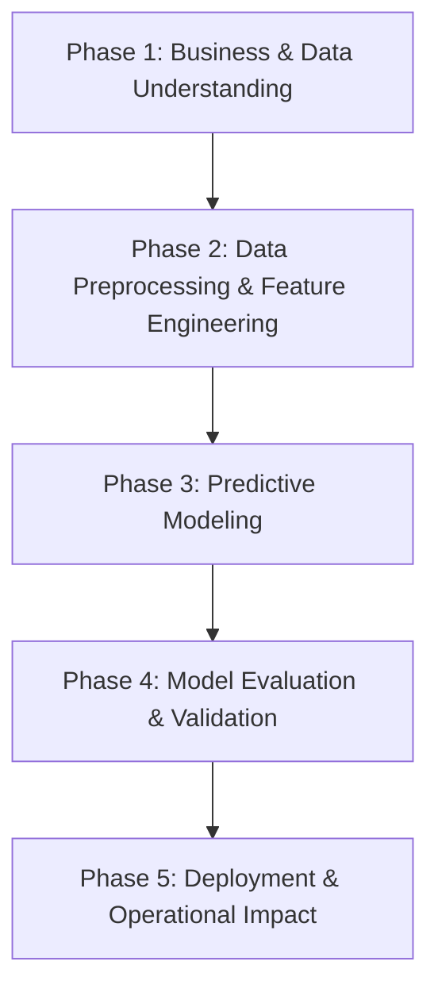
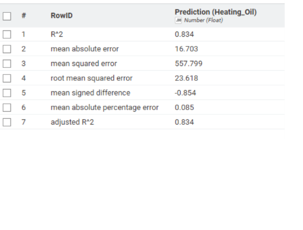

# ⚡ Residential Heating Oil Consumption Forecasting (KNIME Workflow)

## 🏗️ Workflow Architecture

### 1. Data Ingestion & Preprocessing Phase


### 2. Model Training & Evaluation Phase


## 📌 Executive Summary
An end-to-end predictive analytics workflow built on **KNIME Analytics Platform** to forecast residential heating oil consumption (`Heating_Oil`). By analyzing property insulation, ambient temperatures, demographics, and home sizes, this regression model enables fuel suppliers to optimize supply chain inventory, streamline delivery logistics, and mitigate seasonal stockouts.

### 🎯 Key Impact & Business Outcomes
* **Demand Forecasting:** Predicts peak-season heating oil demand to prevent costly stockouts and ensure timely refills.
* **Logistics Optimization:** Improves delivery route scheduling, lowering fleet operational costs and boosting customer service levels.
* **Inventory Cost Reduction:** Optimizes safety stock levels at regional distribution hubs, minimizing warehouse holding costs.
* **Targeted Customer Advisory:** Identifies critical consumption drivers (e.g., home insulation ratings) to provide data-driven energy efficiency recommendations.

---

## 🛠️ Tech Stack & Methods
* **Platform:** KNIME Analytics Platform v5.x
* **Core Nodes Used:** `CSV Reader`, `Partitioning`, `Linear Regression Learner`, `Numeric Scorer`, `Missing Value`, `Excel Writer`
* **Problem Type:** Supervised Machine Learning (Continuous Regression)
* **Target Variable:** `Heating_Oil`

---

## 📖 Data Dictionary

| Column Name | Data Type | Feature Role | Description / Business Meaning | Example Value |
| :--- | :--- | :--- | :--- | :--- |
| **`Insulation`** | `Integer` | Feature (Predictor) | Property insulation quality/density rating (scale index). | `6` |
| **`Temperature`** | `Integer` | Feature (Predictor) | Average outdoor ambient temperature (°F). | `74` |
| **`Heating_Oil`** | **`Integer`** | **Target Variable** | Continuous volume of heating oil consumed (Gallons/Liters). | `132` |
| **`Num_Occupants`** | `Integer` | Feature (Predictor) | Total count of residents living in the property. | `4` |
| **`Avg_Age`** | `Float` | Feature (Predictor) | Average age of all home occupants. | `23.8` |
| **`Home_Size`** | `Integer` | Feature (Predictor) | Property size index / categorized floor area scale. | `4` |

---

## 🚀 Project Plan & Methodology

This project follows the **CRISP-DM** (Cross-Industry Standard Process for Data Mining) framework to ensure a structured, reproducible data science workflow in KNIME:



## 📌 Phase 1: Business & Data Understanding

* **Business Goal**: Identify key factors driving residential heating oil consumption (Heating_Oil) to optimize inventory allocation and delivery routes.
* **Exploratory Data Analysis (EDA)**: Analyzed relationships between independent variables (Insulation, Temperature, Num_Occupants, Avg_Age, Home_Size) and target consumption.

## 📌 Phase 2: Data Preprocessing & Feature Engineering
* **Data Cleaning**: Handled missing values, formatted data types (Float, Integer), and verified distribution patterns.
* **Feature Selection & Partitioning**: Prepared predictor variables and split dataset using Partitioning (80% Training Set, 20% Testing Set) to prevent data leakage.

## 📌 Phase 3: Modeling
* **Algorithm Selection**: Implemented Supervised Machine Learning using Linear Regression Learner in KNIME.
* **Model Training**: Fitted regression equations against training records to capture feature weights and mathematical relationships.

## 📌 Phase 4: Model Evaluation & Validation
* **Performance Scoring**: Evaluated test set predictions via Numeric Scorer node.
* **Key Metrics**: Achieved $R^2$ of 0.802 and MAPE of 8.3%, confirming high predictive accuracy and near-zero systematic bias (MSD = -0.118).

## 📌 Phase 5: Deployment & Operational 
* **ImpactWorkflow Automation**: Exported pipeline to .knwf for batch prediction execution against future property customer lists.
* **Reporting Output**: Generated formatted Excel reports (Excel Writer) containing predicted gallon requirements to support SCM logistics planning.

### 📈 Model Evaluation & Performance Metrics

The predictive model for **Heating Oil** achieved strong statistical performance evaluated via KNIME's Numeric Scorer:

| Metric | Score | Evaluation / Interpretation |
| :--- | :--- | :--- |
| **$R^2$ Score** | **0.802** | Explains 80.2% of the variance in target variable |
| **MAPE** | **8.3%** | Highly accurate predictions with error rate < 10% |
| **MAE** | **16.48** | Average absolute prediction error |
| **RMSE** | **25.44** | Root Mean Squared Error (sensitive to outliers) |
| **Bias (MSD)** | **-0.118** | Near-zero bias (balanced prediction errors) |


> **Conclusion:** The model demonstrates robust performance suitable for operational forecasting with minimal systematic error.

## 📁 Repository Structure
```text
├── workflows/
│   └── Heating_Oil_Prediction_Workflow.knwf  # KNIME workflow file
├── data/
│   ├── raw_heating_oil_data.csv               # Historical dataset
│   └── predicted_consumption_results.xlsx     # Model output predictions
├── assets/
│   ├── full-workflow-preview.png              # High-res canvas screenshot
│   └── evaluation-scorer-metrics.png          # Scorer results image
└── README.md                                  # Repository documentation
```
